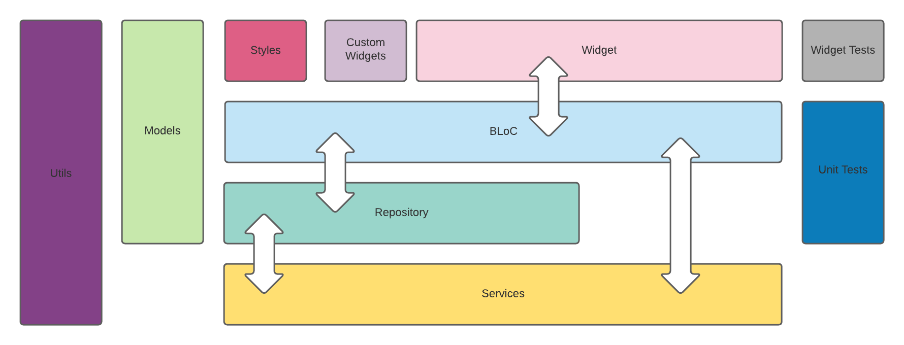

# QR Generator Service, Flutter QR Lib, and QR App

An application, library, and server that includes the following:

1. Flutter QR Lib
2. QR App
3. QR Generator Service

## Flutter QR Lib

flutter_qr_lib is a Flutter library for displaying a QR code
from seed data.

**Version**
0.0.1

**Features**

-   iOS and Android Support
-   No internet connection required

**Installation**

Add the following to your pubspec.yaml file.

Ensure the path location matches the flutter_qr_lib directory

```
flutter_qr_lib: path: ../flutter_qr_lib
```

**Usage**

Import the dependencies in your code

```
import 'package:flutter_qr_lib/qr_controller.dart';
import 'package:flutter_qr_lib/qr_view.dart';
```

To render the QR Code, add the following to your build method

```
    QRView(
        onControllerCreated: (QRController controller) =>
        controller.loadSeed('seed'),
    )
```

**Example**

```
    Container(
        height: 300,
        width: 300,
        alignment: Alignment.center,
        decoration: BoxDecoration(
        color: Colors.white,
        border: Border.all(width: 1.0, color: Colors.grey),
        boxShadow: [
            BoxShadow(
            offset: Offset(1, 1),
            color: Colors.grey[300],
            ),
        ],
        ),
        child: QRView(
                onControllerCreated: (QRController controller) =>
                    controller.loadSeed(_seed),
            ),
    ),
```

**Widgets**

-   QRView:  
    Widget that renders the QR code image

-   QRController:  
    Class that controls the QRView

    **Methods**

    ```
    loadSeed(String value);
    ```

    Load the seed data into the widget for rendering

## Flutter QR App

An example App that utilizies the **flutter_qr_lib** and the **QR Generator Service**

**Version**
0.0.1

**Features**

-   Animated Floating Action button menu  
    
-   Clean Architecture design with the BLoC pattern  
    

**Dependencies**

```yaml
flutter_qr_lib:
    path: ../flutter_qr_lib

get_it: ^5.0.6
provider: ^4.3.3
rxdart: ^0.25.0
http: ^0.12.2
qr_code_scanner: ^0.3.2
flutter_config: ^1.0.8

 mockito: ^4.1.4

```

**Tests**

-   menu_test

    1. Menu Animation: Checks the menu click animation
    2. Menu Click: Checks the menu item click navigation

-   count_down_display

    1. Data loading: Checks data load indicator from stream
    2. Count Down: Verify stream value is display
    3. Error: Verify error is handled

-   seed_bloc_test
    1. QR Code (initial load): Checks navigation and the seed data load
    2. Scan: Checks navigation

## QR Generator Service

Auto generates a 40 character Apha Numeric value via a GET API.

**Server**
Node.js

**Version**
0.0.1

**Tests**

1. generates by length: Checks seed value length
2. generates lowercase: Checks for mix case

**Dependencies**

1. "express": "^4.17.1"

**API Format**

```yaml
paths:
    /seed:
        get:
            description: Get a seed that can be used to generate a QR code
            responses:
                '200':
                    description: seed generated
                    content:
                        application/json:
                            schema:
                                $ref: '#/components/schemas/Seed'
components:
    schemas:
        Seed:
            type: object
            properties:
                seed:
                    type: string
                    example: d43397d129c3de9e4b6c3974c1c16d1f
                expires_at:
                    type: dateTime
                    description: ISO date-time
                    example: '1979-11-12T13:10:42.24Z'
```
