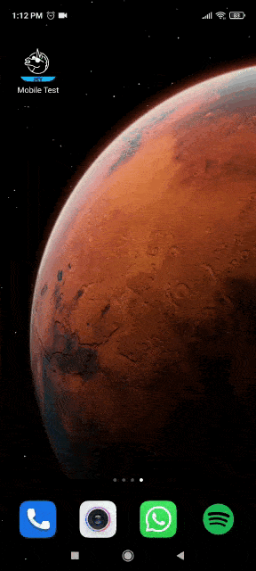
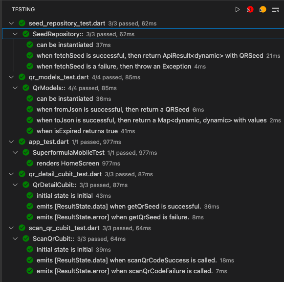

# Superformula Mobile Developer Coding Test

## Dependencies

- bloc
- dio
- flutter_bloc
- freezed
- get_it
- intl
- json_serializable
- qr_code_scanner
- qr_flutter
- bloc_test
_ build_runner
_ mocktail


## Run the project

This project contains 3 flavors:

- development
- staging
- production

To run the desired flavor either use the launch configuration in VSCode/Android Studio or use the following commands:

```sh
# Development
$ flutter run --flavor development --target lib/main_development.dart

# Staging
$ flutter run --flavor staging --target lib/main_staging.dart

# Production
$ flutter run --flavor production --target lib/main_production.dart
```

Anyway, there is are launch settings for VSCode & Android Studio so you can easily launch the project with any flavor. :smile:

## Demo

Show QR code | Scan QR code 
--- | ---
 | 

## Running Tests 🧪

To run all unit and widget tests use the following command:

```sh
$ flutter test --coverage --test-randomize-ordering-seed random
```

If you want to run the tests inside the `packages` folder you can go inside the the specific package and run the same command. :+1:

## Testing

