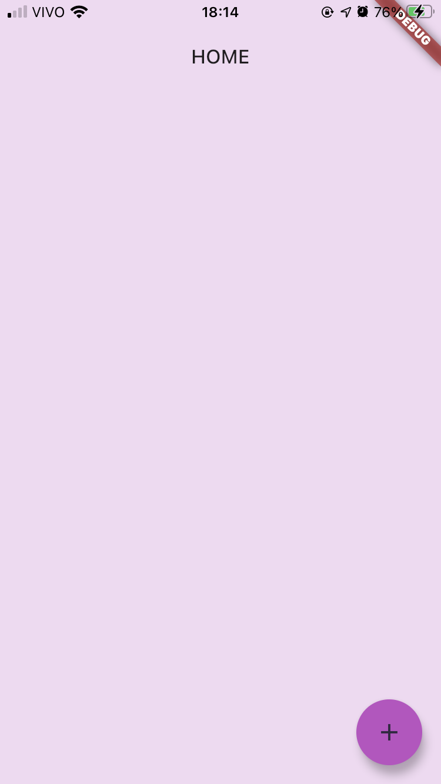
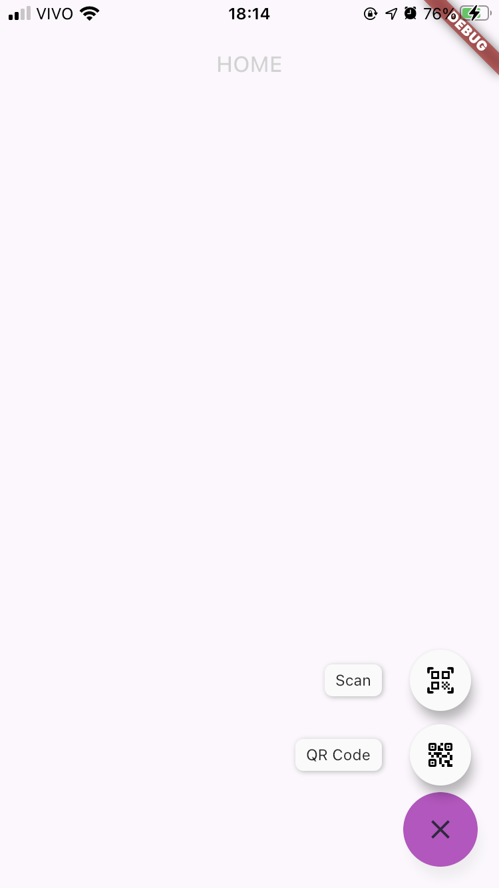
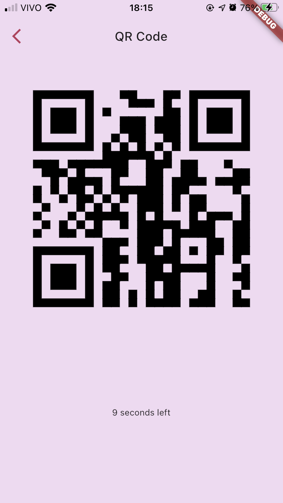
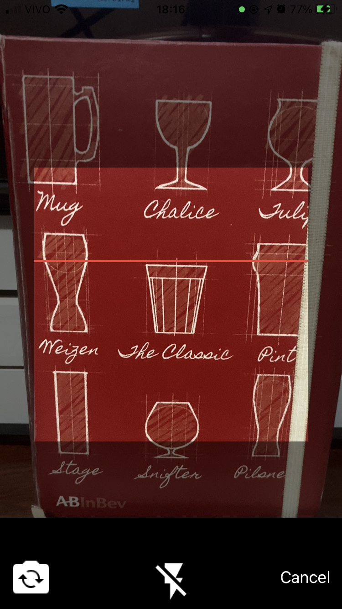
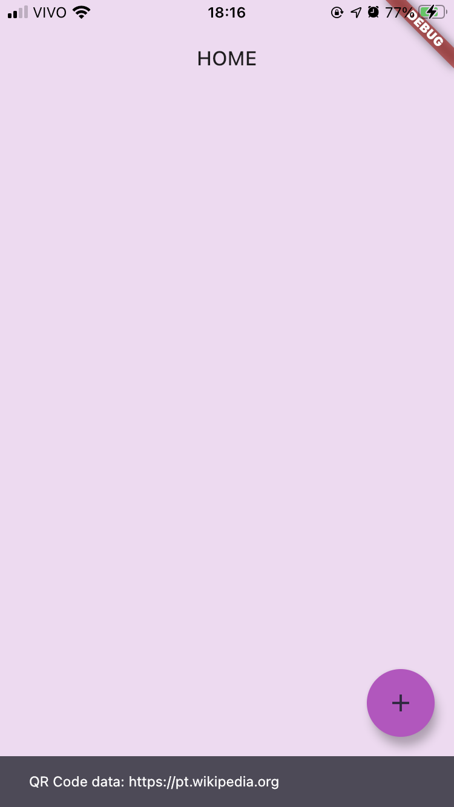

# matheus_massula_test

This project was made to test Matheus Massula skills with Flutter

## What expect

## How it was designed
The project structure was splited on:

    - cubit
        - Business logic layer
    - models
        - data layer
    - pages
        - layoyt layer (pages and widgets)
    - resources
        - strings used on the app and theme
    - services
        - web coomunication and "dependency injection"(InheritedWidget)

## How to run it

    1. Download the source code
    2. Open the downlaoded code on VS Code
    3. Make sure you have the flutter extension installed in your VS Code
    4. Press on keyboad `cmd + shift + p` (this should open the command palette)
    5. Search for `Flutter: Get Packages` and click on it
    6. Press on keyboard 'ctrl + ,' (this should open a search files bar)
    7. Type `main` on search bar
    8. Open an iOS or Android Emulator
    9. Press on keyboard `ctrl + f5` to run the app

## Attention

For iOS devices the scan feature only works on real devices