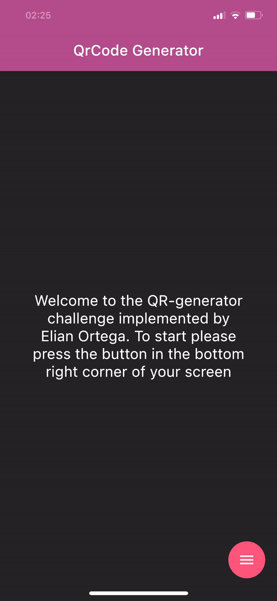
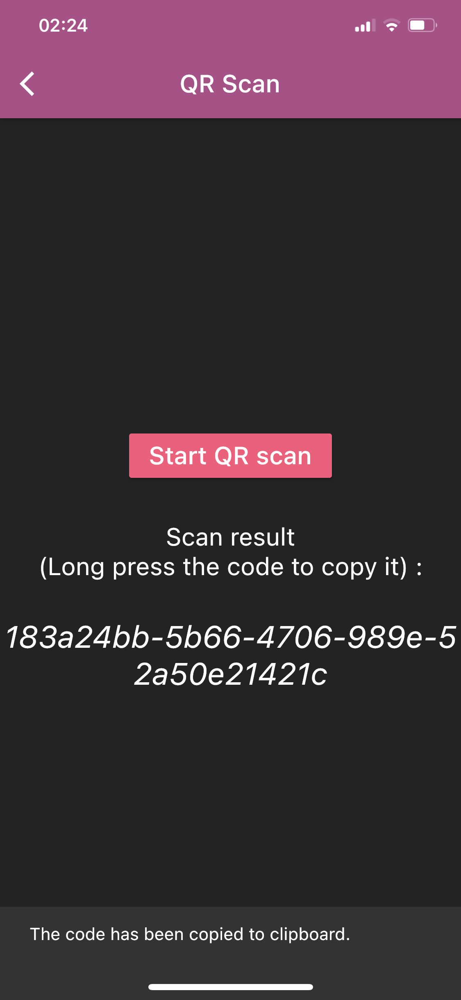
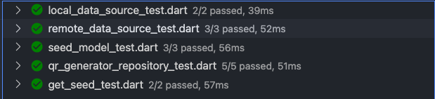
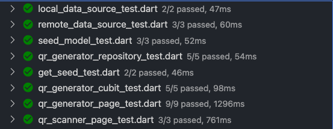
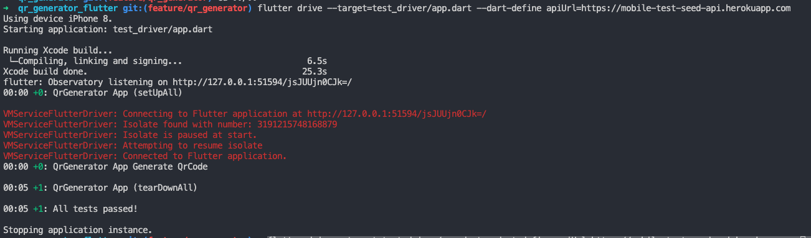
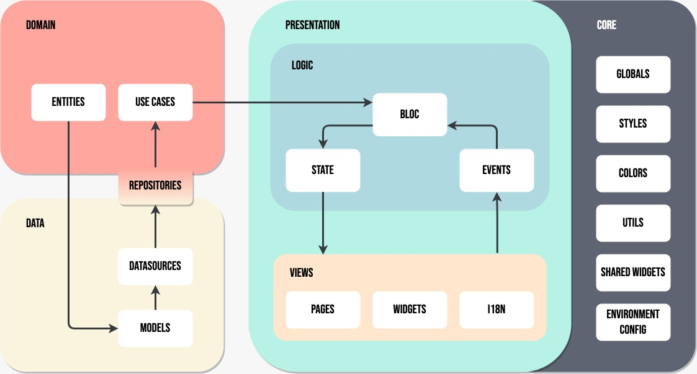

# qr_generator_flutter by Elian Ortega

A flutter application that generates a QR Code base on a seed brought from an API.

- ✅  Clean Architecture
- ✅  Testing
- ✅  Performance
- ✅  Custom Animations
- ✅  Internationalization
- ✅  Locally generated seed on offline status


## To get started 
```
// To start run the following commands 

git clone [repo_url]

cd qr_generator_flutter

flutter pub get

flutter run --dart-define apiUrl=https://mobile-test-seed-api.herokuapp.com
```
## App Preview
 
 
 

## Testing
### ✅ Unit Test

### ✅ Widget Test

```dart
//run the following command to run the widget test
flutter test
```
### ✅ Integration Test

```dart
//run the following command to run the integration test
flutter drive --target=test_driver/app.dart --dart-define apiUrl=https://mobile-test-seed-api.herokuapp.com
```

## Project Structure - Clean Architecture

The following diagram represents the clean architecture approach taken to solve this challenge. This was proposed by myself and a friend and was shared with the Hispanic community as a solution to follow clean architecture practices. The original proposal uses `riverpod` but because of the `decoupling` the was no problem on changing to bloc.

With this approach we achieve a great decoupling and separation of concerns between the different layers of the application.




## API Node.js
The api for the solution was implemented in node.js and `deploy` to `Heroku` with a single endpoint.
The documentation of it can be found in: https://documenter.getpostman.com/view/14734044/TWDcFZom

**API Schema**

```yaml
paths:
    /seed:
        get:
            description: Get a seed that can be used to generate a QR code
            responses:
                '200':
                    description: seed generated
                    content:
                        application/json:
                            schema:
                                $ref: '#/components/schemas/Seed'
components:
    schemas:
        Seed:
            type: object
            properties:
                seed:
                    type: string
                    example: d43397d129c3de9e4b6c3974c1c16d1f
                expires_at:
                    type: dateTime
                    description: ISO date-time
                    example: '1979-11-12T13:10:42.24Z'
```