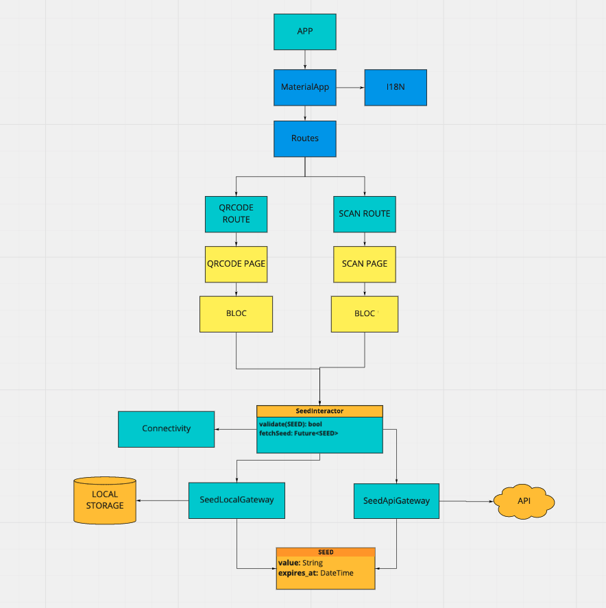

# seed_reader

## How to run
Just run the following commands.

```sh
flutter pub get
flutter run
```

## Architecture

The architecture uses the following resources:
### UI Architecture
Due to the simplicity of the project I've decided to use Bloc UI architecture.


### Route system
The project uses naming routes to build the routing system.
Each router is responsible to connect **bloc** + **page** + **dependencies** by using the [provider](https://pub.dev/packages/provider) library.

### Interactors
The interactors layer is responsible to provide the resources by using the gateways.

### Gateways
The gateways layer is the boundaries that communicate with S.O or Web services.

### Dependency Injection
All interactors are injected using the [get_it](https://pub.dev/packages/get_it) library and blocs are injected with the provider.

### Internacionalization
The i18n of the app was built using a [VsCode extension](https://marketplace.visualstudio.com/items?itemName=localizely.flutter-intl) that generates the localization logic.
The architecture uses the following resources:


